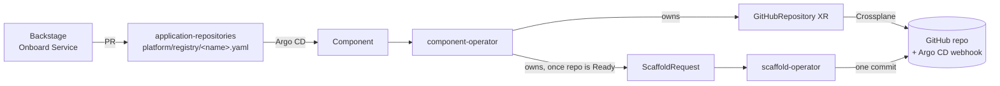
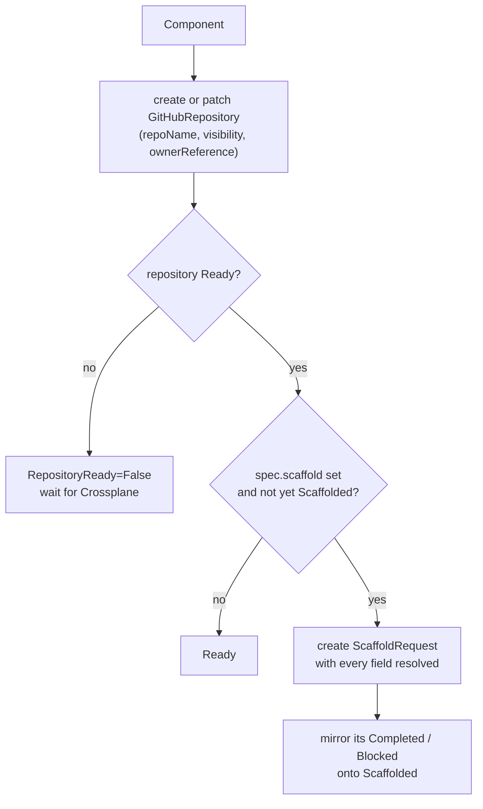

# component-operator

A Kubernetes operator for the platform's **`Component`** API
(`platform.taskapp.io/v1alpha1`): the identity record of a piece of software
(name, owner, repository). From one small `Component` it creates a GitHub
repository and asks for it to be seeded from a versioned template.

- **Identity, not orchestration.** `Component` owns only what is intrinsic to
  it: its repository and the one-time scaffold. Databases, releases and other
  capabilities are separate resources that point back with `componentRef`.
- **Infrastructure through Crossplane.** The repository is a Crossplane
  `GitHubRepository`. The operator never calls the GitHub API itself.
- **Status in one place.** `kubectl get component` shows whether the repository
  exists and whether scaffolding finished, and if not, why.

Written in Go with kubebuilder and controller-runtime. It runs on the
platform's `management` cluster.

## Where it fits



The `GitHubRepository` API comes from
[crossplane-compositions](https://github.com/entr0pian/crossplane-compositions),
and [scaffold-operator](https://github.com/entr0pian/scaffold-operator) renders
the template from [platform-scaffolds](https://github.com/entr0pian/platform-scaffolds).
Once the repository's CI has built an image,
[release-operator](https://github.com/entr0pian/release-operator) deploys it.

## The API

```yaml
apiVersion: platform.taskapp.io/v1alpha1
kind: Component
metadata:
  name: payments
  namespace: platform
spec:
  owner: team-payments            # catalog owner
  repository:
    name: payments                # default: metadata.name
    visibility: public            # public | private | internal, default private
  scaffold:                       # optional, acted on once
    template: golang-service
    version: "0.12.0"
status:
  repository: {name, url, ready}
  scaffold: {template, version, templateRevision, commitSHA, completed}
  conditions: [Ready, RepositoryReady, Scaffolded]
```

Developers don't write this by hand. Backstage's Onboard Service template
renders it into a pull request.

## What it does



- **Repository.** Created on first reconcile. After that, only `repoName` and
  `visibility` are kept in sync. Other fields on the XR are left alone.
- **Scaffold.** Created only after the repository reports `Ready`, because the
  GitHub owner is read from the XR's `status.repoURL`. The request carries
  every value scaffold-operator needs, so scaffold-operator never reads
  `Component`.
- **Once means once.** After `Scaffolded=True`, changing `spec.scaffold` does
  nothing. Upgrading an existing repository to a newer template is a separate,
  deliberate change.
- **Reacting to children.** It watches the `GitHubRepository` and
  `ScaffoldRequest` it owns, so their status changes trigger a reconcile
  without any polling.

## Design choices

- **Two ownership exceptions, on purpose.** Most capabilities are independent
  resources joined by `componentRef`, so `Component` doesn't grow into an
  orchestration engine. The repository and its first commit are the exceptions:
  a component without its source repository isn't a component.
- **Deleting a Component deletes the repository.** The controller
  `ownerReference` cascades to the XR, and Crossplane's default `Delete` policy
  removes the real GitHub repository. Removing an onboarding file is therefore
  a destructive change, and it goes through review like any other PR.
- **`autoInit: true` on every repository.** GitHub's Git Data API, which
  scaffold-operator uses to write its single commit, rejects writes to a
  repository with no commits. An initial commit gives the scaffold a parent.
- **Foreign types read as unstructured.** `GitHubRepository` and
  `ScaffoldRequest` belong to other projects, and the operator doesn't vendor
  their Go types. If either CRD isn't installed yet, it waits instead of
  failing.
- **No GitHub credentials.** Crossplane holds the token that creates
  repositories, and scaffold-operator holds its own GitHub App. This operator
  only needs Kubernetes RBAC.

## Status

`Ready=True` needs `RepositoryReady=True` and, when `spec.scaffold` is set,
`Scaffolded=True`. Otherwise `Ready` carries the reason of whichever step is
behind:

| Condition | Reasons |
|---|---|
| `RepositoryReady` | The XR's own `Ready` reason, `RepositoryProvisioning` before it reports, or `GitHubRepositoryCRDNotInstalled` |
| `Scaffolded` | `Completed`, `ScaffoldPending`, or the request's `Blocked` reason and message, so you can see why scaffolding stalled |

## Delivery

Every push runs lint, unit/envtest, e2e on kind, and a Helm install test. On
`main`, once all of them pass, CI pushes `ghcr.io/entr0pian/component-operator:<sha>`.
The shared `bump-infra` workflow then pins this operator's chart and image to
that SHA in `application-repositories`, and Argo CD rolls it out to
`management`.

## Development

```sh
make test       # unit + envtest
make lint
make test-e2e   # kind cluster
make run        # against the current kubeconfig
```

The API lives in `api/v1alpha1/`. After changing it, run
`make manifests generate` and mirror the CRD into `chart/templates/crd/`.

## License

Apache 2.0.
